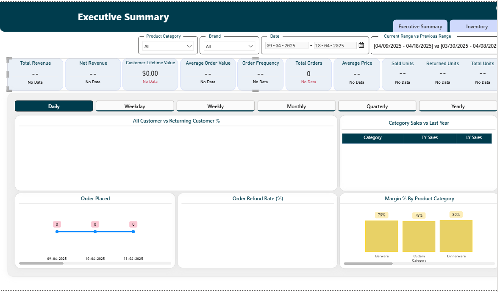

48
160
373
93

539
82

373
82

how to filter inventory data with date filter on page

there was huge difference by putting date filter on executive summary page

General questions about formetting:
doubt to replace blank values with zero or not

current range vs previous range 
or 
Previous range vs current range

data problem of inventory with date range cause F_inventory has not any date column

brand and category in inventory
indevidual metrix row: brand with values shown in photo
indevidual metrix row: category with values shown in photo

putted gap in drop down filter

research:

min max price
types of inventory

My understandings from today meeting:
Takeaway Points:
•   Do research in depth about any topic which was given

Action Items:
•   Perform research in depth about Min and Max price in Ecommerce Term
•   Perform research about Types of Quantity of product in Inventory

My Daily Update :
last day(17-01-2026): 
•   Added the brand Filter in Executive Summary page: 30 minutes   
•   Adjusted filters according to format and putted space between options: 1 hour
•   Made the header of Executive summary page according to guidelines: 1 Hour
•   Created metrixs to show details by brand and category(yet to add in inventory page): 1 hour
•   Adjusted the canvas height to display all KPIs in Executive summary : 15 minutes
•   Adjusted the cards in Executive summary according to guidelines: 1.5 hours
•   Put the other visuals accordingly to display meaning ful information the : 1 hour

Today:
•   Complete the executive summary page according to guidelines: 2 hours
•   Update the Page Information Feature according to the new format of page: 2 Hours
•   Add matrixs in inventory page: 1.5 hours

930

min price:Your minimum Price should be the lowest price you are willing to sell your product at when you take into account your various costs
max price: Your Maximum Price should be a realistic price for your product but high enough to secure a good profit.

The next important thing to note is that your Minimum and Maximum Prices are made up of both your product's sale price and shipping.

prices are automatically changes by platform according to various strategies
