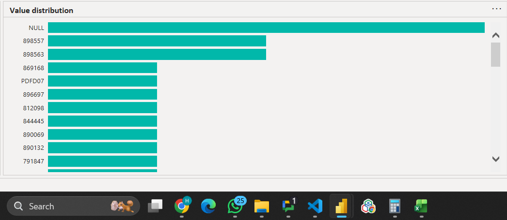
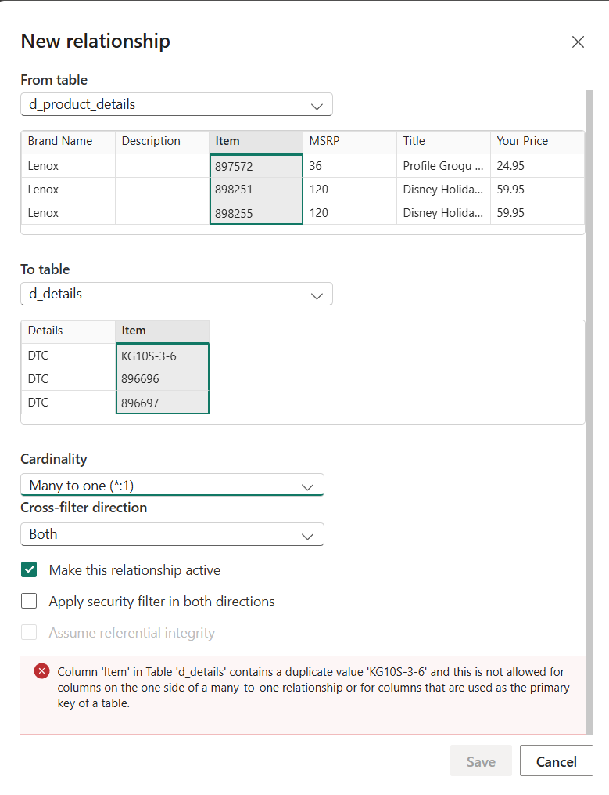
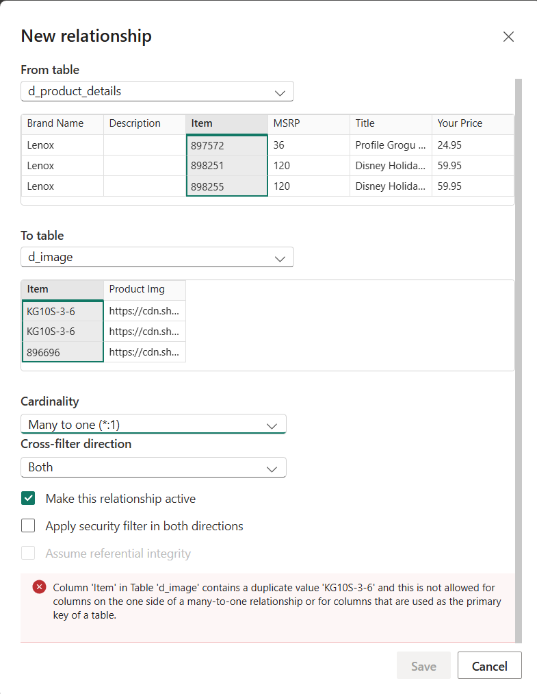
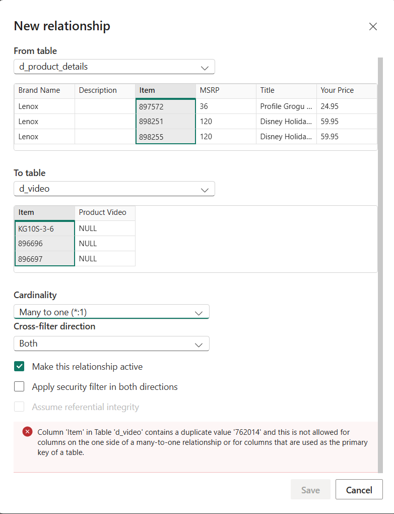
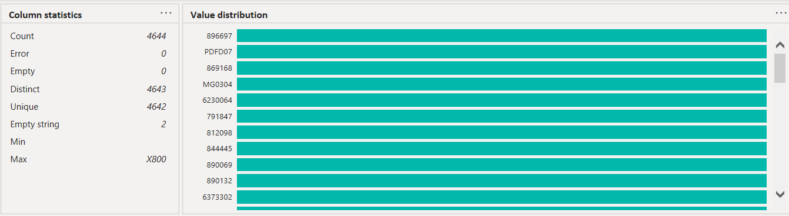
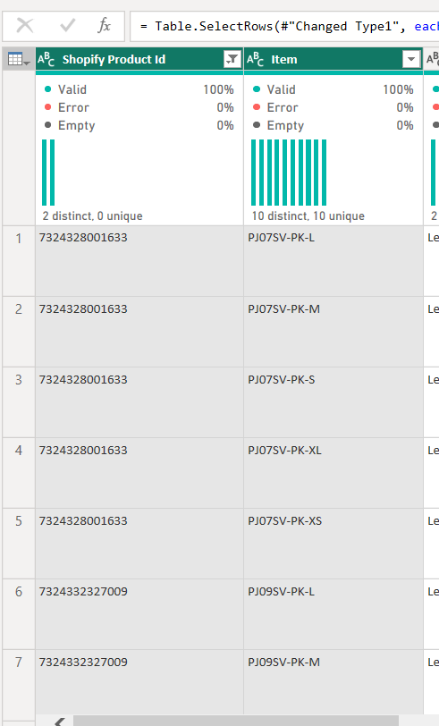

LY = 
IF(
    SELECTEDVALUE(Revenue_quantity_table[type]) = "Revenue", 
    IF([Net Revenue]<>BLANK(),FORMAT([LY Net Revenue], "$0.00")), 
    IF([Sold Units]<>BLANK(),[LY Total Sales])
)

TY = 
IF(
    SELECTEDVALUE(Revenue_quantity_table[type]) = "Revenue", 
    IF([Net Revenue]<>BLANK(),FORMAT([Net Revenue],"$0.00")),
    [Sold Units]
)

IF([Sold Units]<>BLANK(),
COALESCE(CALCULATE(
    [Sold Units],
    SAMEPERIODLASTYEAR('D_Date'[Date])
),0)
)

IF([Net Revenue]<>BLANK(),
COALESCE(CALCULATE(
    [Net Revenue],
    SAMEPERIODLASTYEAR('D_Date'[Date])
),0)
)

LY = 
IF(
    SELECTEDVALUE(Revenue_quantity_table[type]) = "Revenue", 
    [LY Net Revenue], 
    [LY Total Sales]
)

why there was products with $0.

howmany images, how many details, how many have that <ul> in details

Date: 21-Jan-2026
Attendee: Arpan, Kishan, Harshang

Key Takeaways from Today’s Meeting:
•   First understand the data before working
•   Analyze each problem and do structured approach to solve it

Action Items:
•   create dimention tables from the main csv data
•   then create visuals which display the data issue

    
    

    7324332327009
    7324328001633
    

My Daily Update :
Yesterday(21-01-2026): 
•   Solve the issue(Onclick on info Icon filters changed): 15 Minutes   
•   worked on the calculation of this year vs last year: 1.5 Hours
•   created a basic sashboard to show product data : 2.5 Hours
•   understand the data and created multiple dimension tables from one product table: 1 Hour
•   understand the data and remove faulty records to create relationships to only one to many: 45 minutes
•   worked on table visual to display counts(images, detais and videos):45 minutes
•   Understand the new data and created indevisual tables for videos, images and details :1.5 hours

Today:
•   create a calculation for order refund rate: 2 hours
•   work on the calculation of this year vs last year: 2 hours
•   validate the executive summary dashboard with test spark data: 1 hour
•   Refine the KPI calculations after discussion  : 2 hours

