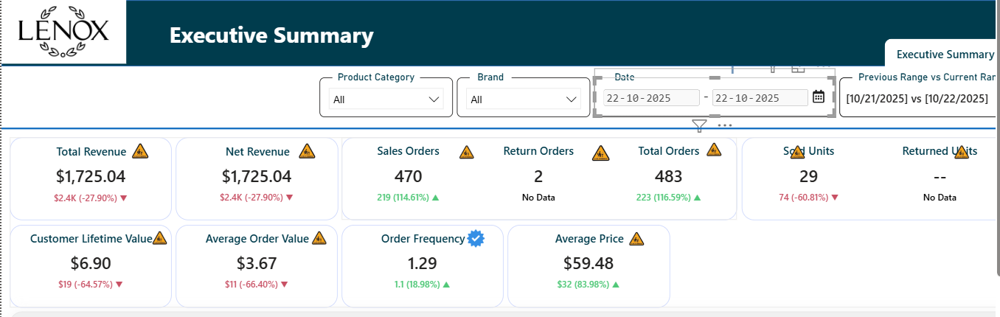
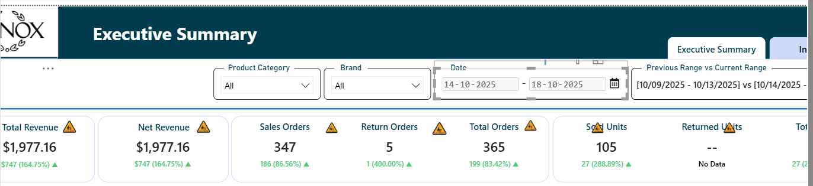
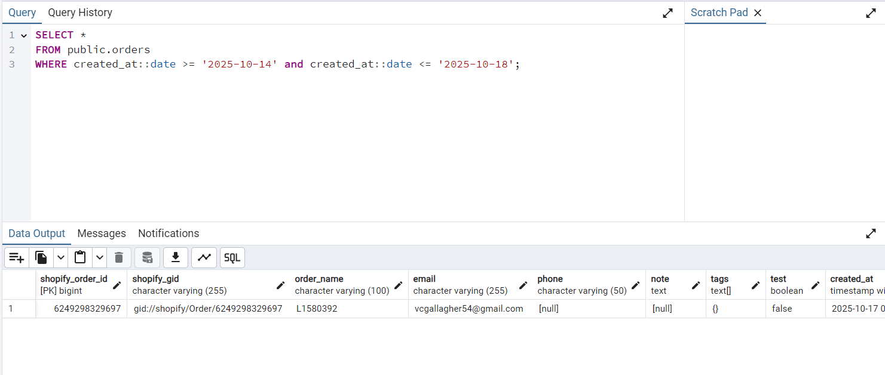

Date: 23-Jan-2026
Attendee: Arpan Sir, Prince Sir, Harshang

Key Takeaways from Today’s Meeting:
•   Format the numbers in dashboard(currency and the saperators)
•   there should not be any blank area in dashboard

Action Items:
•   Add the filter to filter out the Inventory field
•   Add percentage of instock products with inventory column
•   add clear all filters button
•   Add the categoryL2 into the data from postgres database

with data as (select
        p.shopify_product_id as "Shopify Product Id",
        p.shopify_gid as "Unique Product Id",
        pv.sku AS "Item",
        p.title AS "Title",
        p.status AS "Status",
        p.vendor AS "Brand Name",
        p.total_inventory as "Inventory Available",
        p.total_variants as "Total Variants",
        pv.compare_at_price AS "MSRP",
        pv.price AS "Your Price",
        p.description AS "Description",
		pmt_cat.value AS "Category",
        array_agg(DISTINCT pi.url) FILTER (WHERE pi.url IS NOT NULL) AS "Product Images",
        array_agg(DISTINCT pm.video_sources) FILTER (WHERE pm.video_sources IS NOT null) AS "Product Videos",
        trim(
          regexp_replace(
            regexp_replace(
              regexp_replace(
                coalesce(pmt.value, ''),
                '(?is)</li>\s*<li>', E'\n• ', 'g'
              ),
              '(?is)<\sli\s>', '• ', 'g'
            ),
            '(?is)<[^>]+>', '', 'g'
          )
        ) AS "Details",
        p.online_store_url as "Store URL"
    FROM products p
    LEFT JOIN product_variants pv
           ON p.shopify_product_id = pv.product_id
    LEFT JOIN product_images pi
           ON p.shopify_product_id = pi.product_id
    LEFT JOIN product_media pm
           ON p.shopify_product_id = pm.product_id
    INNER JOIN product_metafields pmt 
           ON p.shopify_product_id = pmt.product_id 
           AND pmt.key = 'bullet_list_copy'
	LEFT JOIN product_metafields pmt_cat 
           ON p.shopify_product_id = pmt_cat.product_id 
           AND pmt_cat.key = 'ware_description'	
    GROUP BY
        p.shopify_product_id,
        p.shopify_gid,
        p.title,
        p.status,
        p.vendor,
        pv.compare_at_price,
        pv.price,
        p.description,
        pmt.value,
		pmt_cat.value,
        pv.sku,
        p.online_store_url,
        p.total_inventory,
        p.total_variants
)
select * from data 
order by "Status";

4860

6895

SELECT key, value, COUNT(*) as frequency
FROM public.product_metafields
WHERE key = 'category_hierarchy_2'
GROUP BY key, value
ORDER BY frequency DESC;

with data as (select
        p.shopify_product_id as "Shopify Product Id",
        p.shopify_gid as "Unique Product Id",
        pv.sku AS "Item",
        p.title AS "Title",
        p.status AS "Status",
        p.vendor AS "Brand Name",
        p.total_inventory as "Inventory Available",
        p.total_variants as "Total Variants",
        pv.compare_at_price AS "MSRP",
        pv.price AS "Your Price",
        p.description AS "Description",
		pmt_cat.value AS "Category",
        pmt_cat2.value AS "Category 2",
        array_agg(DISTINCT pi.url) FILTER (WHERE pi.url IS NOT NULL) AS "Product Images",
        array_agg(DISTINCT pm.video_sources) FILTER (WHERE pm.video_sources IS NOT null) AS "Product Videos",
        trim(
          regexp_replace(
            regexp_replace(
              regexp_replace(
                coalesce(pmt.value, ''),
                '(?is)</li>\s*<li>', E'\n• ', 'g'
              ),
              '(?is)<\sli\s>', '• ', 'g'
            ),
            '(?is)<[^>]+>', '', 'g'
          )
        ) AS "Details",
        p.online_store_url as "Store URL"
    FROM products p
    LEFT JOIN product_variants pv
           ON p.shopify_product_id = pv.product_id
    LEFT JOIN product_images pi
           ON p.shopify_product_id = pi.product_id
    LEFT JOIN product_media pm
           ON p.shopify_product_id = pm.product_id
    INNER JOIN product_metafields pmt 
           ON p.shopify_product_id = pmt.product_id 
           AND pmt.key = 'bullet_list_copy'
	LEFT JOIN product_metafields pmt_cat 
           ON p.shopify_product_id = pmt_cat.product_id 
           AND pmt_cat.key = 'category_hierarchy_1'	
    GROUP BY
        p.shopify_product_id,
        p.shopify_gid,
        p.title,
        p.status,
        p.vendor,
        pv.compare_at_price,
        pv.price,
        p.description,
        pmt.value,
		pmt_cat.value,
        pv.sku,
        p.online_store_url,
        p.total_inventory,
        p.total_variants
)
select * from data 
order by "Status";

include category hierarchy one and 3

SELECT min(created_at
), max(created_at) FROM public.orders

   22-10-2025 483

SELECT count(shopify_order_id) FROM public.orders
WHERE created_at::date = '2025-10-22';               9 orders

   14-10-2025 to 18-10-2025  365

SELECT count(shopify_order_id) FROM public.orders
WHERE created_at::date >= '2025-10-14' and created_at::date <= '2025-10-18';  1 order

also checked with updated at, processed at

all the data was in Shopify.product  and mcProductData

7324270690401_898444  , Dinnerware,https://www.lenox.com/products/chef-snoopy-tea-cup-saucers-set-of-4, web site data: ,"Category Hierarchy 1:Dinnerware","Category1:Dinnerware"

7193586401377_895952, Category Hierarchy 1:Dinnerware, https://www.lenox.com/products/oneida-terrazzo-melamine-mint-12-piece-dinnerware-set, Website data: "Category1:Dinnerware","Category1:Dinnerware"

7193729663073_896500,Category Hierarchy 1:Home Decor, https://www.lenox.com/products/holiday-figural-santas-rocket-covered-candy-dish  , website data: "Category1:Dinnerware", "Category Hierarchy 1:Dinnerware"

7381027061857_899437, Glassware, https://www.lenox.com/products/dtoc-ruffle-bell-glass-s-5, not available in web site

7381027029089_899250, Glassware, https://www.lenox.com/products/ruffle-glass-tumbler-s-4, not available in web site

7193622839393_895978,Category Hierarchy 1:Glassware,https://www.lenox.com/products/oneida-stackables-smoke-drinkware-set-of-12, "Category1:Drinkware","Category1:Glassware", "Category1:Drinkware","Category1:Glassware", "Category1:Hydration"

7193528336481_92832GTHHDS, Category Hierarchy 1:Barware, https://www.lenox.com/products/cambridge-20-oz-hammered-rainbow-moscow-mule-mugs-set-of-4, Website data: "Category1:Drinkware","Category1:Hydration", "Category1:Hydration"

7324229369953_898238, Barware, https://www.lenox.com/products/make-merry-stemless-martini-glasses-set-of-4,"Category1:Barware", "Category1:Barware", "Category1:Barware"

7193460801633_H290020AL20, Category Hierarchy 1:Flatware, https://www.lenox.com/products/oneida-satin-nocha-20-piece-everyday-flatware-set, website data: "Category1:Flatware"
7398551552097_899221,Flatware, https://www.lenox.com/products/delia-mirror-72-piece-flatware-set, websitedata: "Category1:Flatware", "Category1:Flatware"

also add all 3 in dashboard

also there was some problem that product should display the category in product page

My Daily Update :
Last Friday(23-01-2026): 
•   create a different cards in executive summary(sell order, return orders): 1 hour
•   changed the refund amount and orders calculations: 1 hour
•   work on Data health dadhboard: 3 hours
    - work on calculation of count of videos, images, MSRP
    - display related information in dashboard
•   created a SQL query to get the data of product category(explored database and created a query to determine product category ): 1.5 hours
•   worked on sql query to get category hierarchy 1 as category in data  : 1 hour
•   checked the data(count of orders in shopify data and azure synapse data in dashboard): 45 minutes
•   checked the category hirearchy 1 data problem: 1 hour

Today:
•   create a sql query to get all 3 levels of categpry: 1 hour
•   apply changes in power query with new data: 30 minutes
•   work on Data health dadhboard: 3 hours
    - add new category filter
    - add new kpi to show percentage of instock products 
    - add new filter for instock products 
•   work on Executive Summary Dashboard: 4 hours
    - understand the new KPIs which can be added
    - get the data for new KPIs
    - create calculations for new KPIs
